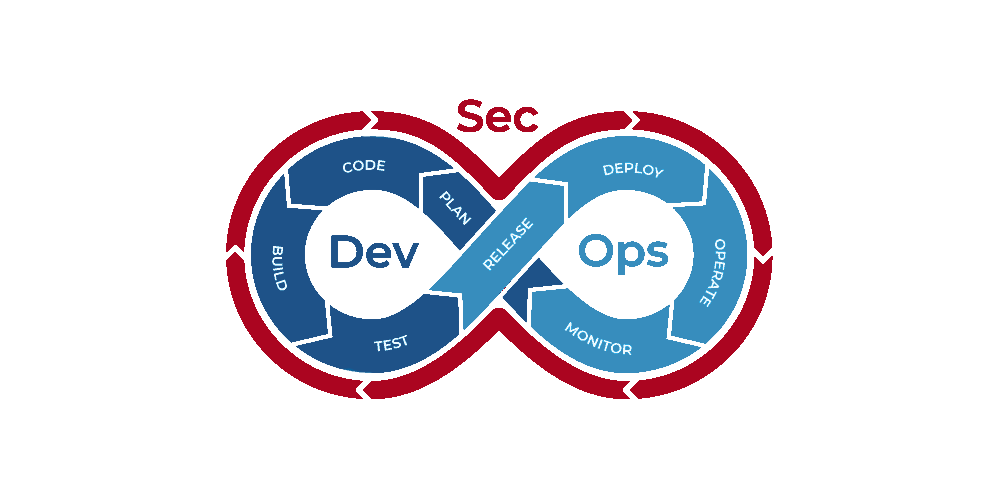
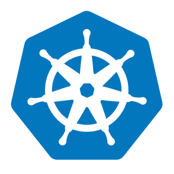
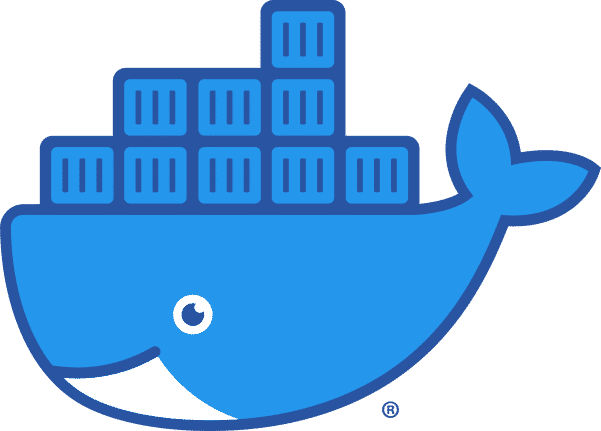
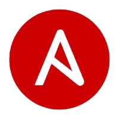

  

<h1 align="center">Hi there,&nbsp; I'm Vikas! </h1>

  

---

## 📊 Github Stats

    

    
  
   
  <b>Note:</b> Top languages is only a metric of the languages my public code consists of and doesn't reflect experience or skill level.
 
 

---

## 🚀 My Skills

<table align="center">
  <tr>
    <td align="center" width="96">
      
       Kubernetes
    </td>
    <td align="center" width="96">
      
       Docker
    </td>
    <td align="center" width="96">
      
       AWS
    </td>
    <td align="center" width="96">
      
       Ansible
    </td>
    <td align="center" width="96">
      
       AWS
    </td>
    <td align="center" width="96">
      
       Azure
    </td>
  </tr>

  <tr>
    <td align="center" width="96">
      
       Python
    </td>
    <td align="center" width="96">
      
       Go
    </td>
    <td align="center" width="96">
      
       Argo_CD
    </td>
    <td align="center" width="96">
      
       Jenkins
    </td>
    <td align="center" width="96">
      
       GitHub_Actions
    </td>
    <td align="center" width="96">
      
       Azure_DevOps
    </td>
  </tr>
</table>

---

## ⚡ Certifications

- Certified Kubernetes Application Developer (CKAD)
- Certified Kubernetes Administrator (CKA)
- Microsoft Azure Administrator Associate
- Microsoft Azure Fundamentals
- HashiCorp Certified Terraform Associate
- AWS Certified Solutions Architect – Associate
- AWS Certified Solutions Architect – Professional
- AWS Certified SysOps Administrator – Associate
- PCEP – Certified Entry-Level Python Programmer
- Docker Certified Associate
